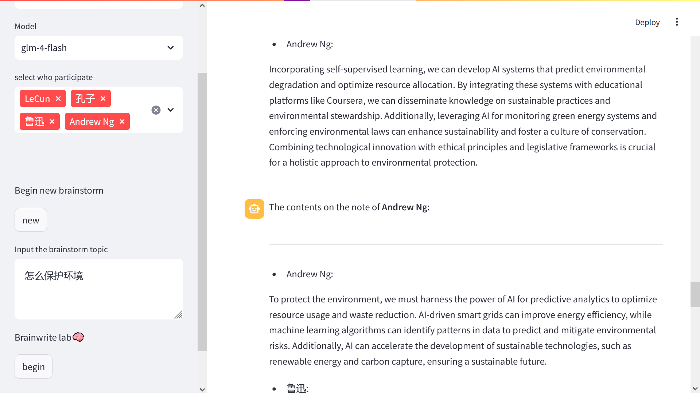
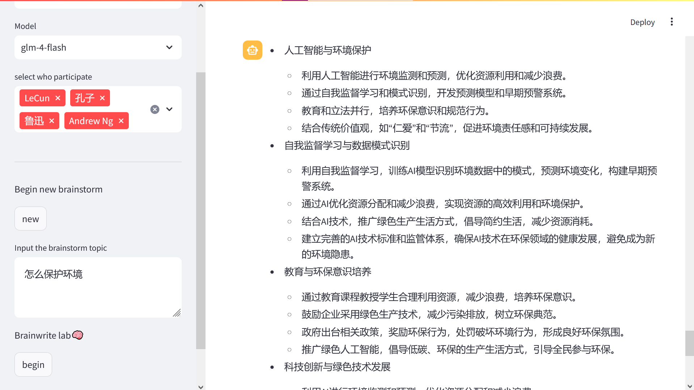

# Brainwrite_lab 🧠

## 简单介绍

通过streamlit 搭建的 LLM 扮演不同角色进行头脑风暴的平台

## 项目文件与用途

- README.md 当前文档，提供了项目的基本信息。
- data/background.json 记录不同角色的身份提示词
- package/openai_sdk.py 通过openai的sdk请求大模型能力
- main.py 主程序需要在streamlit中运行

## 运行效果

# brainwrite_lab_expand
